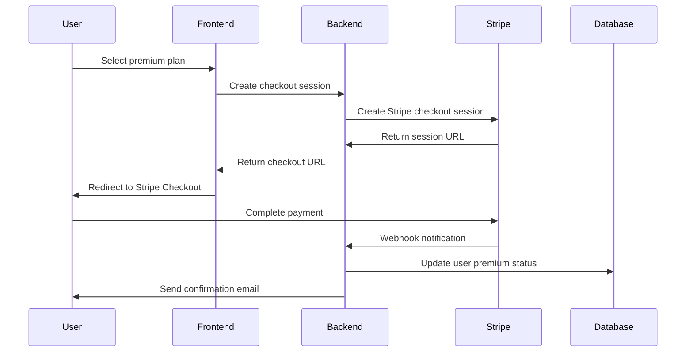

# WorkNow Payment System Documentation

## Overview

WorkNow integrates with **Stripe** to provide a comprehensive payment solution for premium subscriptions, job boosting, and platform monetization. The system supports multiple subscription tiers, automatic renewals, and secure payment processing.

## Stripe Integration

### What is Stripe?

Stripe is a leading payment processing platform that provides:
- **Payment Processing**: Credit cards, digital wallets, bank transfers
- **Subscription Management**: Recurring billing and automatic renewals
- **Webhook System**: Real-time payment event notifications
- **Security**: PCI DSS compliance and fraud protection
- **Global Support**: Multiple currencies and payment methods

### Why Stripe for WorkNow?

- **Reliability**: 99.9%+ uptime guarantee
- **Security**: Enterprise-grade security standards
- **Developer Experience**: Excellent API and documentation
- **Scalability**: Handles high-volume transactions
- **International**: Supports Israeli market requirements

## Setup and Configuration

### 1. Stripe Account Setup

1. **Create Account**: Sign up at [stripe.com](https://stripe.com)
2. **Activate Account**: Complete business verification
3. **Get API Keys**: Copy publishable and secret keys
4. **Configure Webhooks**: Set up webhook endpoints

### 2. Environment Variables

```env
# Stripe Configuration
STRIPE_SECRET_KEY=sk_test_...
STRIPE_PUBLISHABLE_KEY=pk_test_...
STRIPE_WEBHOOK_SECRET=whsec_...

# Premium Plans
PREMIUM_BASIC_PRICE_ID=price_123456
PREMIUM_DELUXE_PRICE_ID=price_789012
```

### 3. Stripe Configuration

```javascript
// server/utils/stripe.js
import Stripe from 'stripe';

const stripe = new Stripe(process.env.STRIPE_SECRET_KEY, {
  apiVersion: '2023-10-16',
  typescript: true
});

export default stripe;
```

## Premium Subscription Plans

### 1. Plan Structure

| Plan | Price | Features | Benefits |
|------|-------|----------|----------|
| **Free** | $0/month | Basic job posting | Standard features |
| **Premium Basic** | $19/month | Job boosting, extended stats | Priority placement |
| **Premium Deluxe** | $39/month | All basic + advanced features | Maximum visibility |

### 2. Feature Comparison

#### Free Plan
- ✅ Post up to 5 jobs per month
- ✅ Basic job management
- ✅ Standard search visibility
- ✅ Email notifications

#### Premium Basic
- ✅ All Free features
- ✅ Post up to 20 jobs per month
- ✅ Job boosting (priority placement)
- ✅ Extended job statistics
- ✅ Priority customer support

#### Premium Deluxe
- ✅ All Basic features
- ✅ Unlimited job postings
- ✅ Advanced analytics dashboard
- ✅ Featured job placement
- ✅ Dedicated account manager
- ✅ API access

## Payment Flow

### 1. Subscription Purchase



### 2. Implementation

#### Frontend Checkout

```jsx
// src/components/PremiumPage.jsx
import { useState } from 'react';
import { useAuth } from '@clerk/clerk-react';

function PremiumPage() {
  const { getToken } = useAuth();
  const [loading, setLoading] = useState(false);

  const handleSubscribe = async (priceId) => {
    try {
      setLoading(true);
      
      const token = await getToken();
      const response = await fetch('/api/payments/create-checkout-session', {
        method: 'POST',
        headers: {
          'Authorization': `Bearer ${token}`,
          'Content-Type': 'application/json'
        },
        body: JSON.stringify({
          priceId,
          successUrl: `${window.location.origin}/success`,
          cancelUrl: `${window.location.origin}/cancel`
        })
      });

      const { data } = await response.json();
      
      // Redirect to Stripe Checkout
      window.location.href = data.url;
      
    } catch (error) {
      console.error('Subscription failed:', error);
      toast.error('Failed to create subscription');
    } finally {
      setLoading(false);
    }
  };

  return (
    <div className="premium-plans">
      <div className="plan-card">
        <h3>Premium Basic</h3>
        <p className="price">$19/month</p>
        <ul>
          <li>Job boosting</li>
          <li>Extended statistics</li>
          <li>Priority support</li>
        </ul>
        <button 
          onClick={() => handleSubscribe(process.env.PREMIUM_BASIC_PRICE_ID)}
          disabled={loading}
        >
          {loading ? 'Processing...' : 'Subscribe Now'}
        </button>
      </div>
      
      <div className="plan-card featured">
        <h3>Premium Deluxe</h3>
        <p className="price">$39/month</p>
        <ul>
          <li>All Basic features</li>
          <li>Unlimited postings</li>
          <li>Advanced analytics</li>
          <li>Dedicated support</li>
        </ul>
        <button 
          onClick={() => handleSubscribe(process.env.PREMIUM_DELUXE_PRICE_ID)}
          disabled={loading}
        >
          {loading ? 'Processing...' : 'Subscribe Now'}
        </button>
      </div>
    </div>
  );
}
```

#### Backend Checkout Session

```javascript
// server/controllers/payments.js
import stripe from '../utils/stripe.js';

export const createCheckoutSession = async (req, res) => {
  try {
    const { priceId, successUrl, cancelUrl } = req.body;
    const { user } = req;

    // Create Stripe checkout session
    const session = await stripe.checkout.sessions.create({
      payment_method_types: ['card'],
      line_items: [
        {
          price: priceId,
          quantity: 1,
        },
      ],
      mode: 'subscription',
      success_url: successUrl,
      cancel_url: cancelUrl,
      customer_email: user.email,
      metadata: {
        clerkUserId: user.sub,
        planType: priceId === process.env.PREMIUM_DELUXE_PRICE_ID ? 'deluxe' : 'basic'
      }
    });

    res.json({
      success: true,
      data: {
        sessionId: session.id,
        url: session.url
      }
    });

  } catch (error) {
    console.error('Checkout session creation failed:', error);
    res.status(500).json({
      success: false,
      error: 'Failed to create checkout session'
    });
  }
};
```

## Webhook Handling

### 1. Webhook Configuration

```javascript
// server/controllers/webhookController.js
import stripe from '../utils/stripe.js';
import { handleSubscriptionUpdate } from '../services/webhookService.js';

export const handleStripeWebhook = async (req, res) => {
  const sig = req.headers['stripe-signature'];
  const webhookSecret = process.env.STRIPE_WEBHOOK_SECRET;

  let event;

  try {
    // Verify webhook signature
    event = stripe.webhooks.constructEvent(req.body, sig, webhookSecret);
  } catch (err) {
    console.error('Webhook signature verification failed:', err.message);
    return res.status(400).send(`Webhook Error: ${err.message}`);
  }

  try {
    // Handle the event
    switch (event.type) {
      case 'customer.subscription.created':
        await handleSubscriptionCreated(event.data.object);
        break;
      case 'customer.subscription.updated':
        await handleSubscriptionUpdated(event.data.object);
        break;
      case 'customer.subscription.deleted':
        await handleSubscriptionDeleted(event.data.object);
        break;
      case 'invoice.payment_succeeded':
        await handlePaymentSucceeded(event.data.object);
        break;
      case 'invoice.payment_failed':
        await handlePaymentFailed(event.data.object);
        break;
      default:
        console.log(`Unhandled event type: ${event.type}`);
    }

    res.json({ received: true });
  } catch (error) {
    console.error('Webhook handling failed:', error);
    res.status(500).json({ error: 'Webhook processing failed' });
  }
};
```

### 2. Subscription Management

```javascript
// server/services/webhookService.js
import { prisma } from '../lib/prisma.js';
import { sendPremiumEmail } from './premiumEmailService.js';

export const handleSubscriptionCreated = async (subscription) => {
  const { clerkUserId, planType } = subscription.metadata;
  
  // Update user premium status
  await prisma.user.update({
    where: { clerkUserId },
    data: {
      isPremium: true,
      premiumDeluxe: planType === 'deluxe',
      stripeSubscriptionId: subscription.id,
      premiumEndsAt: new Date(subscription.current_period_end * 1000),
      isAutoRenewal: subscription.cancel_at_period_end === false
    }
  });

  // Send welcome email
  await sendPremiumEmail(clerkUserId, 'welcome', planType);
};

export const handleSubscriptionUpdated = async (subscription) => {
  const { clerkUserId, planType } = subscription.metadata;
  
  await prisma.user.update({
    where: { clerkUserId },
    data: {
      premiumDeluxe: planType === 'deluxe',
      premiumEndsAt: new Date(subscription.current_period_end * 1000),
      isAutoRenewal: subscription.cancel_at_period_end === false
    }
  });
};

export const handleSubscriptionDeleted = async (subscription) => {
  const { clerkUserId } = subscription.metadata;
  
  await prisma.user.update({
    where: { clerkUserId },
    data: {
      isPremium: false,
      premiumDeluxe: false,
      stripeSubscriptionId: null,
      premiumEndsAt: null,
      isAutoRenewal: false
    }
  });

  // Send cancellation email
  await sendPremiumEmail(clerkUserId, 'cancelled');
};
```

## Job Boosting System

### 1. Boost Implementation

```javascript
// server/controllers/jobController.js
export const boostJob = async (req, res) => {
  try {
    const { id } = req.params;
    const { user } = req;

    // Check if user has premium
    if (!user.isPremium) {
      return res.status(403).json({
        success: false,
        error: 'Premium subscription required for job boosting'
      });
    }

    // Update job with boost timestamp
    const boostedJob = await prisma.job.update({
      where: { 
        id: parseInt(id),
        userId: user.sub // Ensure user owns the job
      },
      data: {
        boostedAt: new Date()
      }
    });

    res.json({
      success: true,
      data: boostedJob
    });

  } catch (error) {
    console.error('Job boost failed:', error);
    res.status(500).json({
      success: false,
      error: 'Failed to boost job'
    });
  }
};
```

### 2. Boosted Job Display

```jsx
// src/components/JobCard.jsx
function JobCard({ job }) {
  const isBoosted = job.boostedAt && 
    new Date(job.boostedAt) > new Date(Date.now() - 24 * 60 * 60 * 1000);

  return (
    <div className={`job-card ${isBoosted ? 'boosted' : ''}`}>
      {isBoosted && (
        <div className="boost-badge">
          🚀 Boosted
        </div>
      )}
      
      <h3>{job.title}</h3>
      <p className="salary">{job.salary}</p>
      <p className="description">{job.description}</p>
      
      <div className="job-meta">
        <span className="city">{job.city.name}</span>
        <span className="category">{job.category.name}</span>
        {job.shuttle && <span className="shuttle">🚌 Shuttle</span>}
        {job.meals && <span className="meals">🍽️ Meals</span>}
      </div>
      
      <div className="job-actions">
        <button className="btn btn-primary">Contact</button>
        {job.userId === currentUserId && (
          <>
            <button className="btn btn-secondary">Edit</button>
            <button className="btn btn-danger">Delete</button>
            {!isBoosted && user.isPremium && (
              <button className="btn btn-boost">🚀 Boost</button>
            )}
          </>
        )}
      </div>
    </div>
  );
}
```

## Subscription Management

### 1. Cancel Subscription

```javascript
// server/controllers/payments.js
export const cancelSubscription = async (req, res) => {
  try {
    const { user } = req;
    
    if (!user.stripeSubscriptionId) {
      return res.status(400).json({
        success: false,
        error: 'No active subscription found'
      });
    }

    // Cancel subscription in Stripe
    await stripe.subscriptions.update(user.stripeSubscriptionId, {
      cancel_at_period_end: true
    });

    // Update user in database
    await prisma.user.update({
      where: { clerkUserId: user.sub },
      data: {
        isAutoRenewal: false
      }
    });

    res.json({
      success: true,
      message: 'Subscription cancelled successfully'
    });

  } catch (error) {
    console.error('Subscription cancellation failed:', error);
    res.status(500).json({
      success: false,
      error: 'Failed to cancel subscription'
    });
  }
};
```

### 2. Reactivate Subscription

```javascript
export const reactivateSubscription = async (req, res) => {
  try {
    const { user } = req;
    
    if (!user.stripeSubscriptionId) {
      return res.status(400).json({
        success: false,
        error: 'No subscription found'
      });
    }

    // Reactivate subscription in Stripe
    await stripe.subscriptions.update(user.stripeSubscriptionId, {
      cancel_at_period_end: false
    });

    // Update user in database
    await prisma.user.update({
      where: { clerkUserId: user.sub },
      data: {
        isAutoRenewal: true
      }
    });

    res.json({
      success: true,
      message: 'Subscription reactivated successfully'
    });

  } catch (error) {
    console.error('Subscription reactivation failed:', error);
    res.status(500).json({
      success: false,
      error: 'Failed to reactivate subscription'
    });
  }
};
```

## Billing Management

### 1. Billing Page

```jsx
// src/components/BillingPage.jsx
import { useState, useEffect } from 'react';
import { useAuth } from '@clerk/clerk-react';

function BillingPage() {
  const { user } = useAuth();
  const [billingInfo, setBillingInfo] = useState(null);
  const [loading, setLoading] = useState(true);

  useEffect(() => {
    fetchBillingInfo();
  }, []);

  const fetchBillingInfo = async () => {
    try {
      const response = await fetch('/api/payments/billing-info');
      const data = await response.json();
      setBillingInfo(data.data);
    } catch (error) {
      console.error('Failed to fetch billing info:', error);
    } finally {
      setLoading(false);
    }
  };

  const handleCancelSubscription = async () => {
    if (confirm('Are you sure you want to cancel your subscription?')) {
      try {
        const response = await fetch('/api/payments/cancel-subscription', {
          method: 'POST',
          headers: {
            'Authorization': `Bearer ${await getToken()}`
          }
        });

        if (response.ok) {
          toast.success('Subscription cancelled successfully');
          fetchBillingInfo(); // Refresh data
        }
      } catch (error) {
        toast.error('Failed to cancel subscription');
      }
    }
  };

  if (loading) return <div>Loading...</div>;

  return (
    <div className="billing-page">
      <h2>Billing & Subscription</h2>
      
      <div className="subscription-info">
        <h3>Current Plan</h3>
        <div className="plan-details">
          <p className="plan-name">
            {billingInfo?.isPremium ? 'Premium' : 'Free'}
            {billingInfo?.premiumDeluxe && ' Deluxe'}
          </p>
          <p className="plan-status">
            Status: {billingInfo?.isPremium ? 'Active' : 'Inactive'}
          </p>
          {billingInfo?.premiumEndsAt && (
            <p className="renewal-date">
              Next billing: {new Date(billingInfo.premiumEndsAt).toLocaleDateString()}
            </p>
          )}
        </div>
      </div>

      <div className="billing-actions">
        {billingInfo?.isPremium && (
          <>
            <button 
              onClick={handleCancelSubscription}
              className="btn btn-danger"
            >
              Cancel Subscription
            </button>
            
            <button 
              onClick={() => window.location.href = '/premium'}
              className="btn btn-primary"
            >
              Change Plan
            </button>
          </>
        )}
        
        {!billingInfo?.isPremium && (
          <button 
            onClick={() => window.location.href = '/premium'}
            className="btn btn-primary"
          >
            Upgrade to Premium
          </button>
        )}
      </div>
    </div>
  );
}
```

## Payment Analytics

### 1. Revenue Tracking

```javascript
// server/services/paymentAnalyticsService.js
export const getPaymentAnalytics = async (req, res) => {
  try {
    const { startDate, endDate } = req.query;
    
    // Get Stripe payment data
    const payments = await stripe.paymentIntents.list({
      created: {
        gte: new Date(startDate).getTime() / 1000,
        lte: new Date(endDate).getTime() / 1000
      },
      limit: 100
    });

    // Calculate metrics
    const totalRevenue = payments.data.reduce((sum, payment) => {
      return sum + (payment.amount / 100); // Convert from cents
    }, 0);

    const subscriptionCount = payments.data.filter(
      payment => payment.metadata.type === 'subscription'
    ).length;

    res.json({
      success: true,
      data: {
        totalRevenue,
        subscriptionCount,
        payments: payments.data
      }
    });

  } catch (error) {
    console.error('Payment analytics failed:', error);
    res.status(500).json({
      success: false,
      error: 'Failed to fetch payment analytics'
    });
  }
};
```

### 2. Dashboard Display

```jsx
// src/components/AdminDashboard.jsx
function AdminDashboard() {
  const [analytics, setAnalytics] = useState(null);

  useEffect(() => {
    fetchAnalytics();
  }, []);

  const fetchAnalytics = async () => {
    const response = await fetch('/api/admin/payment-analytics');
    const data = await response.json();
    setAnalytics(data.data);
  };

  return (
    <div className="admin-dashboard">
      <h2>Payment Analytics</h2>
      
      <div className="metrics-grid">
        <div className="metric-card">
          <h3>Total Revenue</h3>
          <p className="metric-value">
            ${analytics?.totalRevenue?.toFixed(2) || '0.00'}
          </p>
        </div>
        
        <div className="metric-card">
          <h3>Active Subscriptions</h3>
          <p className="metric-value">
            {analytics?.subscriptionCount || 0}
          </p>
        </div>
      </div>
    </div>
  );
}
```

## Security and Compliance

### 1. PCI Compliance

- **No card data storage**: All payment data handled by Stripe
- **Secure transmission**: HTTPS encryption for all communications
- **Token-based payments**: Use Stripe tokens instead of raw card data

### 2. Fraud Protection

```javascript
// Implement Stripe Radar for fraud detection
const session = await stripe.checkout.sessions.create({
  // ... other options
  payment_method_collection: 'always',
  payment_method_types: ['card'],
  billing_address_collection: 'required',
  customer_creation: 'always'
});
```

### 3. Webhook Security

```javascript
// Verify webhook signatures
const verifyWebhook = (payload, signature, secret) => {
  try {
    return stripe.webhooks.constructEvent(payload, signature, secret);
  } catch (err) {
    throw new Error(`Webhook signature verification failed: ${err.message}`);
  }
};
```

## Testing

### 1. Test Cards

Use Stripe test cards for development:

- **Success**: `4242 4242 4242 4242`
- **Decline**: `4000 0000 0000 0002`
- **3D Secure**: `4000 0025 0000 3155`

### 2. Test Scripts

```bash
# Test payment flow
node tools/test-payment-flow.js

# Test webhook handling
node tools/test-webhook.js

# Test subscription management
node tools/test-subscription.js
```

### 3. Test Environment

```javascript
// tools/test-payment-flow.js
import stripe from '../server/utils/stripe.js';

const testPaymentFlow = async () => {
  try {
    // Create test customer
    const customer = await stripe.customers.create({
      email: 'test@example.com',
      source: 'tok_visa'
    });

    console.log('✅ Test customer created:', customer.id);

    // Create test subscription
    const subscription = await stripe.subscriptions.create({
      customer: customer.id,
      items: [{ price: process.env.PREMIUM_BASIC_PRICE_ID }]
    });

    console.log('✅ Test subscription created:', subscription.id);

  } catch (error) {
    console.error('❌ Test failed:', error);
  }
};

testPaymentFlow();
```

## Troubleshooting

### Common Issues

1. **Webhook Not Working**
   - Check webhook endpoint accessibility
   - Verify webhook secret matches
   - Check server logs for errors

2. **Payment Declined**
   - Verify test card numbers
   - Check Stripe dashboard for errors
   - Review payment intent status

3. **Subscription Not Updating**
   - Check webhook delivery
   - Verify database updates
   - Review error logs

### Getting Help

- **Stripe Documentation**: [stripe.com/docs](https://stripe.com/docs)
- **Stripe Support**: Available in dashboard
- **Community**: Stripe Discord and forums
- **Logs**: Check server and Stripe dashboard logs

## Best Practices

1. **Always verify webhook signatures**
2. **Handle payment failures gracefully**
3. **Implement proper error handling**
4. **Log all payment events**
5. **Use test mode for development**
6. **Monitor webhook delivery**
7. **Implement retry logic for failed payments**
8. **Keep Stripe SDK updated**
9. **Test payment flows thoroughly**
10. **Monitor for suspicious activity**

## Conclusion

The WorkNow payment system provides a robust, secure foundation for premium features and platform monetization. By following this guide and implementing Stripe best practices, you'll have a production-ready payment system that scales with your platform's growth while maintaining the highest security standards.
